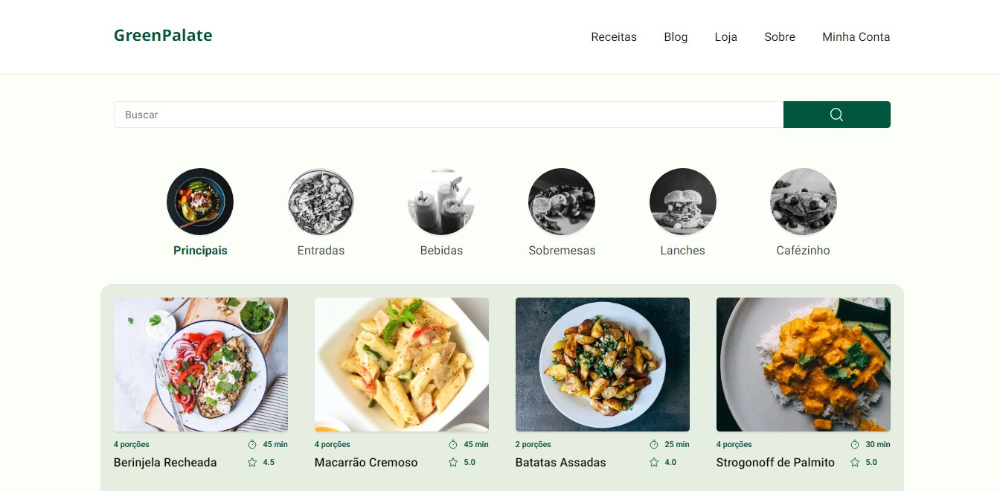

<a name="readme-top"></a>

<!-- PROJECT LOGO -->
<br />
<div align="center">

  <h3 align="center">GreenPalate</h3>

  <p align="center">
    Desenvolvimento de um site de receitas com Next.JS, do design ao deploy
  </p>
</div>


<!-- TABLE OF CONTENTS -->
<details>
  <summary>Sumário</summary>
  <ol>
    <li>
      <a href="#sobre">Sobre</a>
      <ul>
        <li><a href="#tecnologias">Tecnologias</a></li>
      </ul>
    </li>
    <li>
      <a href="#como-rodar-o-projeto">Como rodar o projeto</a>
    </li>
    <li><a href="#contato">Contato</a></li>
    <li><a href="#agradecimentos">Agradecimentos</a></li>
  </ol>
</details>


<!-- ABOUT THE PROJECT -->
## Sobre

<a href="https://github.com/DarkMetaK/green-palate">
    
</a>

O projeto foi desenvolvido como forma de praticar conceitos de UI Design e React. Para sua construção foi utilizado o framework Next.JS, por facilitar a navegação e permitir a construção de um back-end simples. Para simular o banco de dados, foi utilizado o JSON-Server, que é substituido na branch de deploy pela API Route do Next. A estilização foi feita com Stitches.JS por possuir suporte nativo ao Next, permitindo que todo design também seja renderizado pelo servidor. O sistema de autenticação foi feito da maneira mais simples possível, utilizando contextos para verificação e sendo persistido por meio de localstorage. O projeto de design pode ser acessado pelo link: https://www.behance.net/gallery/167260891/GreenPalate/modules/943285627

### Tecnologias

[![Next][Next.js]][Next-url]<br>
[![React][React.js]][React-url]<br>
[![TypeScript][TypeScript.js]][TypeScript-url]<br>
[![Figma][Figma]][Figma-url]<br>

<p align="right">(<a href="#readme-top">Retornar ao topo</a>)</p>

<!-- GETTING STARTED -->
## Como rodar o projeto

É possível acessar o site acessando o link: https://green-palate.vercel.app/

1 - Clone o repositório
```sh
git clone https://github.com/DarkMetaK/green-palate.git
```

2 - Instale as dependências
```sh
npm install
```

3 - Crie um arquivo .env na raiz do projeto e defina a váriavel de ambiente, que será usada para definir o endereço do JSON-Server
```
API_URL= http://localhost:'PORT'
```

4 - Execute o JSON-Server
```sh
npm run api
```

5 - Execute o projeto
```sh
npm run dev
```

<p align="right">(<a href="#readme-top">Retornar ao topo</a>)</p>

<!-- CONTACT -->
## Contato

Matheus Porto - [LinkedIn](https://www.linkedin.com/in/matheusport0/) - matporto03@gmail.com

Link Repositório: [Green-Palate](https://github.com/DarkMetaK/music-player)<br>
Link do Design no Behance: [Design](https://www.behance.net/gallery/167260891/GreenPalate/modules/943285627)

<p align="right">(<a href="#readme-top">Retornar ao topo</a>)</p>

<!-- ACKNOWLEDGMENTS -->
## Agradecimentos

* [Best-README-Template](https://github.com/othneildrew/Best-README-Template)
* [Img Shields](https://shields.io)
* [Next.JS](https://nextjs.org/)
* [Stitches](https://stitches.dev/)
* [Keen-Slider](https://keen-slider.io/)
* [Figma](https://figma.com)
* [Unsplash](https://unsplash.com)

<p align="right">(<a href="#readme-top">Retornar ao topo</a>)</p>

<!-- MARKDOWN LINKS & IMAGES -->
[Next.js]: https://img.shields.io/badge/next.js-000000?style=for-the-badge&logo=nextdotjs&logoColor=white
[Next-url]: https://nextjs.org/
[React.js]: https://img.shields.io/badge/React-20232A?style=for-the-badge&logo=react&logoColor=61DAFB
[React-url]: https://reactjs.org/
[Node.js]: https://img.shields.io/badge/node.js-6DA55F?style=for-the-badge&logo=node.js&logoColor=white
[Node-url]: https://nodejs.org/en/
[TypeScript.js]: https://shields.io/badge/TypeScript-3178C6?logo=TypeScript&logoColor=FFF&style=for-the-badge
[TypeScript-url]: https://www.typescriptlang.org/
[Figma]: https://img.shields.io/badge/figma-%23F24E1E.svg?style=for-the-badge&logo=figma&logoColor=white
[Figma-url]: https://figma.com
